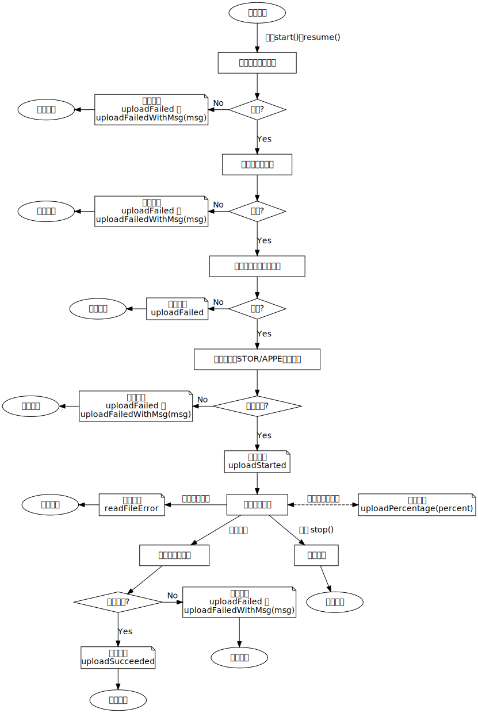

# 文档
## FTPSession
### 概述
### 初始化
首先，创建一个对象。

```cpp
FTPSession *se = new FTPSession(hostname, username, password, port);
```

然后，因为 FTPSession 有关操作都是异步函数，执行结果会通过信号通知调用方，所以要先连接好信号和槽。

```cpp
// connectAndLogin
QObject::connect(se, &FTPSession::connectSucceeded,
                 [](string welcomeMsg) { /*...*/ });
QObject::connect(se, &FTPSession::connectFailedWithMsg, 
                 [](string msg) { /*...*/ });
QObject::connect(se, &FTPSession::connectFailed,
                 []() { /*...*/ });
QObject::connect(se, &FTPSession::createSocketFailed,
                 []() { /*...*/ });
QObject::connect(se, &FTPSession::unableToConnectToServer,
                 []() { /*...*/ });
QObject::connect(se, &FTPSession::loginSucceeded,
                 []() { /*...*/ });
QObject::connect(se, &FTPSession::loginFailedWithMsg, 
                 [](string msg) { /*...*/ });
QObject::connect(se, &FTPSession::loginFailed,
                 []() { /*...*/ });
// getFilesize
QObject::connect(se, &FTPSession::getFilesizeSucceeded,
                 [](int size) { /*...*/ });
QObject::connect(se, &FTPSession::getFilesizeFailedWithMsg, 
                 [](string msg) { /*...*/ });
// getDir
QObject::connect(se, &FTPSession::getDirSucceeded,
                 [](string dir) { /*...*/ });
QObject::connect(se, &FTPSession::getDirFailedWithMsg, 
                 [](string msg) { /*...*/ });
QObject::connect(se, &FTPSession::getDirFailed,
                 []() { /*...*/ });
// changeDir
QObject::connect(se, &FTPSession::changeDirSucceeded,
                 []() { /*...*/ });
QObject::connect(se, &FTPSession::changeDirFailedWithMsg, 
                 [](string msg) { /*...*/ });
QObject::connect(se, &FTPSession::changeDirFailed,
                 []() { /*...*/ });
// setTransferMode
QObject::connect(
    se, &FTPSession::setTransferModeSucceeded, 
                 [](bool binary) { /*...*/ });
QObject::connect(se, &FTPSession::setTransferModeFailedWithMsg,
                 [](string msg) { /*...*/ });
QObject::connect(se, &FTPSession::setTransferModeFailed,
                 []() { /*...*/ });
// deleteFile
QObject::connect(se, &FTPSession::deleteFileSucceeded,
                 []() { /*...*/ });
QObject::connect(se, &FTPSession::deleteFileFailedWithMsg, 
                 [](string msg) { /*...*/ });
QObject::connect(se, &FTPSession::deleteFileFailed,
                 []() { /*...*/ });
// makeDir
QObject::connect(se, &FTPSession::makeDirSucceeded,
                 []() { /*...*/ });
QObject::connect(se, &FTPSession::makeDirFailedWithMsg, 
                 [](string msg) { /*...*/ });
QObject::connect(se, &FTPSession::makeDirFailed,
                 []() { /*...*/ });
// removeDir
QObject::connect(se, &FTPSession::removeDirSucceeded,
                 []() { /*...*/ });
QObject::connect(se, &FTPSession::removeDirFailedWithMsg, 
                 [](string msg) { /*...*/ });
QObject::connect(se, &FTPSession::removeDirFailed,
                 []() { /*...*/ });
// renameFile
QObject::connect(se, &FTPSession::renameFileSucceeded,
                 []() { /*...*/ });
QObject::connect(se, &FTPSession::renameFileFailedWithMsg, 
                 [](string msg) { /*...*/ });
QObject::connect(se, &FTPSession::renameFileFailed,
                 []() { /*...*/ });
// listDir
QObject::connect(se, &FTPSession::listDirSucceeded,
                 [](vector<string> dirList) { /*...*/ });
QObject::connect(se, &FTPSession::listDirFailedWithMsg, 
                 [](string msg) { /*...*/ });
QObject::connect(se, &FTPSession::listDirFailed,
                 []() { /*...*/ });
```

连接好信号和槽之后，调用 `connectAndLogin` 即可连接服务器并登录。

```
se->connectAndLogin();
```

### 功能
#### 连接服务器并登录
`connectAndLogin`

- 可从 `connectSucceeded(welcomeMsg)` 获得服务器的欢迎信息。
- `loginSucceeded` 表示登录成功。命名为"xxxSucceeded"的信号都表示某项操作成功。
- `connectFailedWithMsg(msg)` 和 `loginFailedWithMsg(msg)` 表示服务器消息中的返回码不符合预期。命名为"xxxFailedWithMsg"的信号皆是如此。
- `connectFailed` 和 `loginFailed` 表示执行 `send` 或 `recv` 函数时出现了错误。命名为"xxxFailed"的信号皆是如此。
- `createSocketFailed` 表示创建 socket 失败。
- `unableToConnectToServer` 表示执行 `connect` 函数时无法连接到服务器。

#### 设定传输模式
`setTransferMode`

如果是通过调用 `connectAndLogin` 登录的，那么传输模式会被自动设置为 Binary 模式。

如果调成 ASCII 模式，图片等二进制文件被传输后会失效。

#### 获取当前目录中的文件名
`listWorkingDir`

- 可从 `listWorkingDirSucceeded(dirList)` 中得到文件名
- 如果你把参数 `isNameList` 设为 true，那么获得的就不单是文件名，还包括了其他信息，比如下面这样的

```
-rw-r--r-- 1 ftp ftp          13661 Jul 16 09:48 pic.jpg
-rw-r--r-- 1 ftp ftp             27 Jul 11 00:22 read.md
-rw-r--r-- 1 ftp ftp             20 Jul 12 21:58 text.txt
```

然而 FTP 协议没有规定返回文件信息的格式，所以每个 FTP 服务器都有点不一样，解析起来比较麻烦……所以还是只获取文件名就好了……

#### 获取当前工作目录
`getDir`

从 `getDirSucceeded(dir)` 中获取当前工作路径

#### 改变工作目录
`changeDir`

#### 删除文件
`deleteFile`

#### 重命名文件
`renameFile`

#### 获取文件大小
`getFilesize`

从 `getFilesizeSucceeded(size)` 中获取文件大小，单位：字节

#### 创建目录
`makeDir`

#### 删除目录
`removeDir`

必须先把目录中的文件全部删除，然后才能删目录。递归删除得自己写，这个我没弄。

## UploadFileTask
### 概述
### 初始化
首先创建一个对象，注意参数 `remoteFilepath` 要传入**绝对路径**，要不然文件会存到服务器根目录下。

```cpp
std::ifstream ifs(localFilepath, std::ios_base::in | std::ios_base::binary);
UploadFileTask *task = new UploadFileTask(*se, remoteFilepath, ifs);
```

由于 UploadFileTask 相关操作是异步函数，因此需要连接信号和槽。

```cpp
QObject::connect(task, &UploadFileTask::uploadStarted,
                 []() { /*...*/ });
QObject::connect(task, UploadFileTask::uploadPercentage,
                 [](int percentage) { /*...*/ });
QObject::connect(task, UploadFileTask::uploadSucceeded,
                 []() { /*...*/ });
QObject::connect(task, UploadFileTask::uploadFailedWithMsg,
                 [](string msg) { /*...*/ });
QObject::connect(task, &UploadFileTask::uploadFailed,
                 []() { /*...*/ });
QObject::connect(task, &UploadFileTask::readFileError,
                 []() { /*...*/ });
```

连接好信号和槽之后，调用 `start` 即可开始上传任务。

### 功能
#### 开始上传
```cpp
task->start();
```

当上传真正开始时（指发送文件数据到服务器），对象会发射 `uploadStarted` 信号。

#### 停止上传
```cpp
task->stop();
```

#### 上传进度
已上传百分比发生变化时，对象会发射 `uploadPercentage(percentage)` 信号。

### 流程图


## 其他